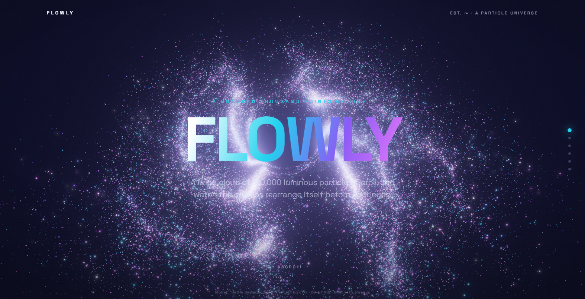

# Flowly — A Particle Universe

A scroll-driven, fully 3D landing page. A single living cloud of **120,000 GPU particles**
continuously morphs between shapes as you scroll — a spiral galaxy, the word **FLOWLY**, a
glowing sphere, a **real 3D model** sampled into points, a DNA double-helix, and finally a
dispersed starfield. Everything glows with real-time bloom, drifts with organic curl-noise,
and reacts to your cursor.



## How it works

- **One `THREE.Points` cloud.** Every shape is precomputed as an array of exactly `N×3`
  positions, so morphing between any two shapes is a clean 1:1 GPU `mix()`.
- **Scroll drives the morph.** Scroll progress (0→1) maps to a position along the shape
  sequence. A custom GLSL `ShaderMaterial` lerps between the two active target buffers with an
  eased `uProgress` uniform. Buffers are only rewritten when the segment changes, so it stays cheap.
- **Organic life.** A per-particle simplex-noise drift keeps the cloud breathing; a `uMouse`
  uniform gently repels particles near the cursor; the camera and whole cloud sway and parallax.
- **Glow.** Additive-blended soft point sprites + `UnrealBloomPass` (threshold-gated so deep
  space stays black) through an `EffectComposer`.
- **A real model.** The 4th shape is sampled from an actual glTF model with
  `MeshSurfaceSampler` — 120k particles snapping onto its surface.

## Stack

React 19 + TypeScript + Vite, with [Three.js](https://threejs.org) (`three@0.184`) for the WebGL engine.

```
src/
  App.tsx              # scroll overlay (copy, CTA, progress rail) + mounts the engine
  index.css            # all page / overlay styling
  three/
    universe.ts        # renderer, camera, bloom composer, scroll + mouse, render loop
    particles.ts       # Points geometry, ShaderMaterial, vertex/fragment GLSL, palette
    shapes.ts          # shape generators: galaxy / text / sphere / helix / starfield / model
    glsl.ts            # shared GLSL (3D simplex noise)
public/
  models/helmet.glb    # sampled 3D model (see credit below)
```

## Run

```bash
npm install
npm run dev          # http://localhost:5173
npm run build        # production bundle in dist/
npm run preview      # serve the production build
```

### Tuning

Open `src/three/universe.ts`:
- `COUNT` — particle count (auto-drops to 45k on small screens).
- `camZ` / `tiltX` — per-shape camera framing.
- `UnrealBloomPass(strength, radius, threshold)` — the glow.

Append `?nobloom` to the URL to render without post-processing (useful on low-end GPUs).

The shape sequence and per-section copy live in `shapes` (universe.ts) and `PANELS` (App.tsx) —
add, remove, or reorder shapes and the scroll mapping adapts automatically.

## Credits

- 3D model: **“Battle Damaged Sci-fi Helmet — PBR”** by [ctxr / theblueturtle_](https://sketchfab.com/theblueturtle_),
  via the [Khronos glTF Sample Models](https://github.com/KhronosGroup/glTF-Sample-Models). Licensed **CC-BY 4.0**.
- Built with [Three.js](https://threejs.org) (MIT). Simplex noise after Ashima Arts / Stefan Gustavson (MIT).
